# KIẾN TRÚC VÀ BẢN ĐỒ LIÊN KẾT GIAO DIỆN PHÂN HỆ QUẢN TRỊ NHÂN SỰ (HRM - SVN DTS)

Tài liệu này tổng hợp toàn bộ **33 màn hình giao diện** (HTML prototype) nằm trong thư mục `stitch_tri_n_khai_thi_t_k_c_u_tr_c`, phân tích cấu trúc quan hệ, phân tầng điều hướng (Primary Sidebar, Sub-tabs ngang, Breadcrumb, Drill-down & Drawers) và cách thức các màn hình liên kết với nhau thông qua sự kiện `onclick`.

---

## I. TỔNG QUAN CẤU TRÚC PHÂN TẦNG VÀ ĐIỀU HƯỚNG

Toàn bộ hệ thống giao diện HRM của SVN DTS được tổ chức theo cấu trúc **Master-Detail & Phân tầng 3 cấp**:
1. **Cấp 1 - Global Primary Navigation (Sidebar trái cố định `w-sidebar-width` ~260px)**:
   - Phân chia thành 4 phân khu nghiệp vụ lớn: **TỔNG QUAN**, **CÁ NHÂN (Employee Self-Service)**, **VẬN HÀNH (HR Operations)**, **QUẢN TRỊ & HỆ THỐNG**.
2. **Cấp 2 - Module Horizontal Sub-tabs (Thanh tab ngang đầu trang)**:
   - Chuyển đổi giữa các phân hệ con, các nghiệp vụ mở rộng hoặc các góc nhìn dữ liệu (Master List vs Detail vs Cấu hình).
3. **Cấp 3 - Quick Actions & In-context Drill-downs (Nút thao tác nhanh, Drawer bên phải `580px-720px`, Popups)**:
   - Mở nhanh chi tiết đối tượng, duyệt nhanh, chuyển hướng ngữ cảnh (ví dụ: Từ Dashboard click *"Việc cần xử lý"* -> chuyển sang màn hình *Inbox*).

```mermaid
flowchart TD
    subgraph Sidebar [Sidebar Điều Hướng Cấp 1]
        M1[Bàn làm việc Dashboard]
        M2[Hồ sơ của tôi]
        M3[Chấm công của tôi]
        M4[Đơn từ & Yêu cầu]
        M5[Phiếu lương]
        M6[Nhân sự & Chức danh]
        M7[Quản lý Ca & Chấm công]
        M8[Xử lý Đơn từ]
        M9[Bảng công tổng hợp]
        M10[Tiền lương & Chi trả]
        M11[Chính sách nhân sự]
    end

    subgraph SubTabs [Cấp 2: Sub-tabs Ngang Chi Tiết]
        M2 --> M2_1[Ngân hàng & Thuế]
        M2 --> M2_2[Quá trình công tác]
        
        M3 --> M3_1[Lịch sử quét thẻ]
        
        M4 --> M4_1[Đơn chờ duyệt]
        M4 --> M4_2[Lịch sử đơn từ]
        
        M5 --> M5_1[Lịch sử phiếu lương]
        
        M6 --> M6_1[Chức danh & JD]
        M6 --> M6_2[Thang bảng lương]
        M6 --> M6_3[Cấu hình lương NS]
        
        M7 --> M7_1[Bảng phân ca Roster]
        M7 --> M7_2[Bổ sung / Sửa công]
        M7 --> M7_3[Log chấm công thô]
        
        M8 --> M8_1[Đơn chờ HR duyệt]
        M8 --> M8_2[Quỹ phép sử dụng]
        M8 --> M8_3[Sổ cái biến động phép]
        
        M9 --> M9_1[Bảng công chi tiết]
        M9 --> M9_2[Quản lý kỳ công / Khóa sổ]
        
        M10 --> M10_1[Chốt lương & Phiếu lương]
        M10 --> M10_2[Xuất file ngân hàng]
        
        M11 --> M11_1[Quy tắc ca & Đi muộn]
        M11 --> M11_2[Quy tắc làm thêm OT]
        M11 --> M11_3[Quy tắc nghỉ phép]
        M11 --> M11_4[Lịch sử phiên bản Audit]
    end
```



---

## II. DANH MỤC 33 MÀN HÌNH & BẢN ĐỒ LIÊN KẾT CHI TIẾT

### 1. Phân khu: TỔNG QUAN (Dashboard & Inbox)
Bao gồm màn hình theo dõi chỉ số điều hành và hộp thư công việc tập trung.

| STT | Tên màn hình | Thư mục chứa file | Quan hệ & Sự kiện liên kết (`onclick`) |
|:---:|---|---|---|
| **01** | **Bàn làm việc (Dashboard)** | `b_n_l_m_vi_c_dashboard_ph_n_h_hrm_svn_dts` | - **Điểm xuất phát trung tâm**.<br>- Nút tab *“Việc cần xử lý”* $\rightarrow$ mở màn hình **02 (Inbox)**.<br>- Nút tab *“Lịch làm việc & Ca kíp”* $\rightarrow$ mở màn hình **13 (Lịch làm việc)**.<br>- Nút *“Tạo đơn nhanh”* $\rightarrow$ mở màn hình **08 (Đơn từ)**.<br>- Link *“Lịch sử chấm công →”* $\rightarrow$ mở màn hình **07 (Lịch sử quét thẻ)**.<br>- Nút *“Kiểm tra / Duyệt bổ sung”* $\rightarrow$ mở màn hình **16 (Bổ sung/sửa công)** hoặc **20 (Duyệt đơn)**. |
| **02** | **Việc cần xử lý (Inbox)** | `vi_c_c_n_x_l_inbox_ph_n_h_hrm_svn_dts` | - Nút *“Xem chi tiết / Phê duyệt”* từng việc $\rightarrow$ trỏ đến chi tiết màn hình **20 (Xử lý đơn HR)** hoặc **16 (Bổ sung sửa công)**.<br>- Nút quay lại $\rightarrow$ màn hình **01 (Dashboard)**. |

---

### 2. Phân khu: CÁ NHÂN (Employee Self-Service - ESS)
Dành cho cán bộ nhân viên tự tra cứu thông tin, chấm công, nộp đơn và xem phiếu lương.

#### Nhóm 2.1: Hồ sơ của tôi (My Profile)
* **Gốc**: `h_s_c_a_t_i_my_profile_ph_n_h_hrm_svn_dts` (Màn hình chính chứa Thông tin chung & Hợp đồng lao động).
* **Các Tab liên kết ngang**:
  - `onclick` Tab **“Ngân hàng & Thuế”** $\rightarrow$ mở màn hình `h_s_c_a_t_i_sub_tab_ng_n_h_ng_thu_svn_dts`.
  - `onclick` Tab **“Quá trình công tác”** $\rightarrow$ mở màn hình `h_s_c_a_t_i_sub_tab_qu_tr_nh_c_ng_t_c_svn_dts`.
  - `onclick` Tab **“Thông tin chung”** $\rightarrow$ quay lại màn hình chính `h_s_c_a_t_i_my_profile_ph_n_h_hrm_svn_dts`.

#### Nhóm 2.2: Chấm công của tôi (My Attendance)
* **Gốc**: `ch_m_c_ng_my_attendance_ph_n_h_hrm_svn_dts` (Bảng chấm công cá nhân theo tháng, tổng hợp giờ làm, đi muộn).
* **Tab liên kết ngang**:
  - `onclick` Tab **“Lịch sử quét thẻ”** $\rightarrow$ mở màn hình `ch_m_c_ng_sub_tab_l_ch_s_qu_t_th_svn_dts`.
  - `onclick` Nút **“Tạo giải trình / Đơn bổ sung công”** $\rightarrow$ mở màn hình **08 (Đơn từ của tôi)** hoặc bật Popup form xin bổ sung công.

#### Nhóm 2.3: Đơn từ & Yêu cầu của tôi (My Requests)
* **Gốc**: `n_t_y_u_c_u_my_requests_ph_n_h_hrm_svn_dts` (Tổng hợp đơn từ cá nhân, nút nộp đơn Nghỉ phép, OT, Công tác, Giải trình).
* **Các Tab liên kết ngang**:
  - `onclick` Tab **“Đơn đang chờ duyệt”** $\rightarrow$ mở màn hình `n_t_y_u_c_u_sub_tab_n_ang_ch_duy_t_svn_dts`.
  - `onclick` Tab **“Lịch sử đơn từ”** $\rightarrow$ mở màn hình `n_t_y_u_c_u_sub_tab_l_ch_s_n_t_svn_dts`.

#### Nhóm 2.4: Phiếu lương của tôi (My Payslips)
* **Gốc**: `phi_u_l_ng_my_payslips_ph_n_h_hrm_svn_dts` (Phiếu lương kỳ gần nhất, chi tiết thu nhập, BHXH, thuế TNCN, thực nhận).
* **Tab liên kết ngang**:
  - `onclick` Tab **“Lịch sử phiếu lương”** $\rightarrow$ mở màn hình `phi_u_l_ng_sub_tab_l_ch_s_phi_u_l_ng_svn_dts` (Xem so sánh các kỳ lương trước).

---

### 3. Phân khu: VẬN HÀNH & CHẤM CÔNG (HR Operations & Time Attendance)

#### Nhóm 3.1: Quản lý Ca làm việc & Chấm công
* **Màn hình liên quan**:
  1. `l_ch_l_m_vi_c_ca_k_p_ph_n_h_hrm_svn_dts`: Màn hình xem và đăng ký lịch trực ca kíp dạng Calendar / Weekly grid.
  2. `qu_n_l_ca_ch_m_c_ng_shift_management_roster_ph_n_h_hrm_svn_dts`: Giao diện tổng quan quản lý ca kíp toàn nhà máy/văn phòng.
* **Các Tab liên kết ngang qua lại**:
  - `onclick` Tab **“Bảng phân ca (Roster)”** $\rightarrow$ mở `qu_n_l_ca_ch_m_c_ng_sub_tab_b_ng_ph_n_ca_roster_svn_dts`.
  - `onclick` Tab **“Bổ sung / Sửa công”** $\rightarrow$ mở `qu_n_l_ca_ch_m_c_ng_sub_tab_b_sung_s_a_c_ng_svn_dts`.
  - `onclick` Tab **“Log chấm công thô”** $\rightarrow$ mở `qu_n_l_ca_ch_m_c_ng_sub_tab_log_ch_m_c_ng_th_svn_dts` (Dữ liệu import trực tiếp từ máy chấm công vân tay/khuôn mặt).

#### Nhóm 3.2: Bảng công tổng hợp (Timesheet Engine)
* **Các Tab liên kết ngang**:
  - `b_ng_c_ng_t_ng_h_p_sub_tab_b_ng_c_ng_chi_ti_t_svn_dts`: Bảng dữ liệu ma trận chấm công ngày 1-31 của từng nhân sự.
  - `b_ng_c_ng_t_ng_h_p_sub_tab_qu_n_l_k_c_ng_kh_a_s_svn_dts`: Quản trị kỳ công (Mở kỳ mới, Khóa sổ kỳ công để chuyển sang tính lương).
  - `onclick` Nút **“Chuyển dữ liệu tính lương”** $\rightarrow$ chuyển hướng sang màn hình **27 (Tính lương & Chi trả)**.

#### Nhóm 3.3: Xử lý Đơn từ (HR Approvals & Quỹ phép)
* **Các Tab liên kết ngang**:
  - `x_l_n_t_sub_tab_n_ch_hr_duy_t_svn_dts`: Danh sách các loại đơn từ toàn công ty đang chờ phòng Nhân sự duyệt cấp 2.
  - `x_l_n_t_sub_tab_qu_ph_p_s_d_svn_dts`: Quản lý hạn mức phép năm, phép thâm niên, số ngày đã nghỉ và còn lại.
  - `x_l_n_t_sub_tab_s_c_i_bi_n_ng_ph_p_svn_dts`: Sổ cái nhật ký cộng/trừ ngày phép theo thời gian thực (Audit ledger).

---

### 4. Phân khu: C&B, LƯƠNG & CHỨC DANH (Compensation & Benefits)

#### Nhóm 4.1: Nhân sự & Chức danh (Employee Registry & Master Data)
* **Gốc**: `nh_n_s_ch_c_danh_hr_operations_ph_n_h_hrm_svn_dts` (Danh sách nhân sự toàn hệ thống).
* **Các Tab liên kết ngang**:
  - `onclick` Tab **“Chức danh & JD”** $\rightarrow$ mở `nh_n_s_ch_c_danh_sub_tab_ch_c_danh_jd_svn_dts` (Mô tả công việc, định biên chức danh).
  - `onclick` Tab **“Thang bảng lương”** $\rightarrow$ mở `nh_n_s_ch_c_danh_sub_tab_thang_b_ng_l_ng_svn_dts` (Bảng ngạch/bậc lương tiêu chuẩn).
  - `onclick` Tab **“Cấu hình lương nhân sự”** $\rightarrow$ mở `nh_n_s_ch_c_danh_sub_tab_c_u_h_nh_l_ng_nh_n_s_svn_dts` (Gán lương cơ bản, phụ cấp, hệ số cụ thể cho từng cá nhân).

#### Nhóm 4.2: Tiền lương & Chi trả (Payroll Engine & Payout)
* **Gốc**: `ti_n_l_ng_chi_tr_payroll_engine_payout_ph_n_h_hrm_svn_dts` (Giao diện tính toán bảng lương tổng hợp theo kỳ).
* **Các Tab liên kết ngang**:
  - `onclick` Tab **“Chốt lương & Phiếu lương”** $\rightarrow$ mở `ti_n_l_ng_chi_tr_sub_tab_ch_t_l_ng_phi_u_l_ng_svn_dts` (Khóa bảng lương, phát hành phiếu lương điện tử cho nhân viên).
  - `onclick` Tab **“Xuất file ngân hàng”** $\rightarrow$ mở `ti_n_l_ng_chi_tr_sub_tab_xu_t_file_ng_n_h_ng_svn_dts` (Tạo file chuyển khoản tự động VCB, TCB, BIDV...).

---

### 5. Phân khu: QUẢN TRỊ CHÍNH SÁCH NHÂN SỰ (HR Policy & Rules Engine)
Bao gồm các màn hình cấu hình quy chế làm việc nội bộ của doanh nghiệp:

* `ch_nh_s_ch_nh_n_s_sub_tab_quy_t_c_ca_i_mu_n_svn_dts`: Thiết lập khung giờ ca chuẩn, ngưỡng tính đi muộn / về sớm, thời gian ân hạn.
* `ch_nh_s_ch_nh_n_s_sub_tab_quy_t_c_l_m_th_m_gi_ot_svn_dts`: Cấu hình hệ số lương làm thêm giờ (Ngày thường x1.5, Nghỉ tuần x2.0, Lễ tết x3.0), duyệt OT trước/sau.
* `ch_nh_s_ch_nh_n_s_sub_tab_quy_t_c_ngh_ph_p_svn_dts`: Quy tắc tích lũy phép năm (12 ngày/năm + thâm niên), thời hạn sử dụng phép tồn.
* `ch_nh_s_ch_nh_n_s_sub_tab_l_ch_s_phi_n_b_n_audit_svn_dts`: Lịch sử thay đổi chính sách theo thời gian, kiểm soát ai sửa và hiệu lực từ ngày nào.

---

## III. BẢNG TRA CỨU ĐIỀU HƯỚNG ONCLICK (ROUTING MAP MATRIX)

Bảng dưới đây quy định chính xác đường dẫn tương đối giữa các màn hình khi gắn sự kiện `onclick` hoặc thẻ `<a href="...">`:

| Từ màn hình (Nguồn) | Vị trí click trên giao diện | Chuyển đến màn hình đích (Target Folder) |
|---|---|---|
| **Mọi màn hình** | Sidebar: `Bàn làm việc (Dashboard)` | `../b_n_l_m_vi_c_dashboard_ph_n_h_hrm_svn_dts/code.html` |
| **Mọi màn hình** | Sidebar: `Hồ sơ của tôi` | `../h_s_c_a_t_i_my_profile_ph_n_h_hrm_svn_dts/code.html` |
| **Mọi màn hình** | Sidebar: `Chấm công` | `../ch_m_c_ng_my_attendance_ph_n_h_hrm_svn_dts/code.html` |
| **Mọi màn hình** | Sidebar: `Đơn từ & Yêu cầu` | `../n_t_y_u_c_u_my_requests_ph_n_h_hrm_svn_dts/code.html` |
| **Mọi màn hình** | Sidebar: `Phiếu lương` | `../phi_u_l_ng_my_payslips_ph_n_h_hrm_svn_dts/code.html` |
| **Mọi màn hình** | Sidebar: `Nhân sự & Chức danh` | `../nh_n_s_ch_c_danh_hr_operations_ph_n_h_hrm_svn_dts/code.html` |
| **Mọi màn hình** | Sidebar: `Quản lý Ca & Chấm công` | `../qu_n_l_ca_ch_m_c_ng_shift_management_roster_ph_n_h_hrm_svn_dts/code.html` |
| **Mọi màn hình** | Sidebar: `Xử lý Đơn từ` | `../x_l_n_t_sub_tab_n_ch_hr_duy_t_svn_dts/code.html` |
| **Mọi màn hình** | Sidebar: `Bảng công tổng hợp` | `../b_ng_c_ng_t_ng_h_p_sub_tab_b_ng_c_ng_chi_ti_t_svn_dts/code.html` |
| **Mọi màn hình** | Sidebar: `Tiền lương & Chi trả` | `../ti_n_l_ng_chi_tr_payroll_engine_payout_ph_n_h_hrm_svn_dts/code.html` |
| **Mọi màn hình** | Sidebar: `Chính sách nhân sự` | `../ch_nh_s_ch_nh_n_s_sub_tab_quy_t_c_ca_i_mu_n_svn_dts/code.html` |
| **Dashboard** | Top tab: `Việc cần xử lý (12)` | `../vi_c_c_n_x_l_inbox_ph_n_h_hrm_svn_dts/code.html` |
| **Dashboard** | Top tab: `Lịch làm việc & Ca kíp` | `../l_ch_l_m_vi_c_ca_k_p_ph_n_h_hrm_svn_dts/code.html` |
| **Hồ sơ của tôi** | Sub-tab: `Ngân hàng & Thuế` | `../h_s_c_a_t_i_sub_tab_ng_n_h_ng_thu_svn_dts/code.html` |
| **Hồ sơ của tôi** | Sub-tab: `Quá trình công tác` | `../h_s_c_a_t_i_sub_tab_qu_tr_nh_c_ng_t_c_svn_dts/code.html` |
| **Chấm công** | Sub-tab: `Lịch sử quét thẻ` | `../ch_m_c_ng_sub_tab_l_ch_s_qu_t_th_svn_dts/code.html` |
| **Đơn từ cá nhân**| Sub-tab: `Đơn đang chờ duyệt` | `../n_t_y_u_c_u_sub_tab_n_ang_ch_duy_t_svn_dts/code.html` |
| **Đơn từ cá nhân**| Sub-tab: `Lịch sử đơn từ` | `../n_t_y_u_c_u_sub_tab_l_ch_s_n_t_svn_dts/code.html` |
| **Phiếu lương** | Sub-tab: `Lịch sử phiếu lương` | `../phi_u_l_ng_sub_tab_l_ch_s_phi_u_l_ng_svn_dts/code.html` |
| **Nhân sự & JD** | Sub-tab: `Chức danh & JD` | `../nh_n_s_ch_c_danh_sub_tab_ch_c_danh_jd_svn_dts/code.html` |
| **Nhân sự & JD** | Sub-tab: `Thang bảng lương` | `../nh_n_s_ch_c_danh_sub_tab_thang_b_ng_l_ng_svn_dts/code.html` |
| **Nhân sự & JD** | Sub-tab: `Cấu hình lương nhân sự` | `../nh_n_s_ch_c_danh_sub_tab_c_u_h_nh_l_ng_nh_n_s_svn_dts/code.html` |
| **Quản lý Ca** | Sub-tab: `Bảng phân ca (Roster)` | `../qu_n_l_ca_ch_m_c_ng_sub_tab_b_ng_ph_n_ca_roster_svn_dts/code.html` |
| **Quản lý Ca** | Sub-tab: `Bổ sung / Sửa công` | `../qu_n_l_ca_ch_m_c_ng_sub_tab_b_sung_s_a_c_ng_svn_dts/code.html` |
| **Quản lý Ca** | Sub-tab: `Log chấm công thô` | `../qu_n_l_ca_ch_m_c_ng_sub_tab_log_ch_m_c_ng_th_svn_dts/code.html` |
| **Bảng công** | Sub-tab: `Quản lý kỳ công / Khóa sổ` | `../b_ng_c_ng_t_ng_h_p_sub_tab_qu_n_l_k_c_ng_kh_a_s_svn_dts/code.html` |
| **Xử lý Đơn HR** | Sub-tab: `Quỹ phép sử dụng` | `../x_l_n_t_sub_tab_qu_ph_p_s_d_svn_dts/code.html` |
| **Xử lý Đơn HR** | Sub-tab: `Sổ cái biến động phép` | `../x_l_n_t_sub_tab_s_c_i_bi_n_ng_ph_p_svn_dts/code.html` |
| **Tiền lương** | Sub-tab: `Chốt lương & Phiếu lương` | `../ti_n_l_ng_chi_tr_sub_tab_ch_t_l_ng_phi_u_l_ng_svn_dts/code.html` |
| **Tiền lương** | Sub-tab: `Xuất file ngân hàng` | `../ti_n_l_ng_chi_tr_sub_tab_xu_t_file_ng_n_h_ng_svn_dts/code.html` |
| **Chính sách NS** | Sub-tab: `Quy tắc làm thêm (OT)` | `../ch_nh_s_ch_nh_n_s_sub_tab_quy_t_c_l_m_th_m_gi_ot_svn_dts/code.html` |
| **Chính sách NS** | Sub-tab: `Quy tắc nghỉ phép` | `../ch_nh_s_ch_nh_n_s_sub_tab_quy_t_c_ngh_ph_p_svn_dts/code.html` |
| **Chính sách NS** | Sub-tab: `Lịch sử phiên bản Audit`| `../ch_nh_s_ch_nh_n_s_sub_tab_l_ch_s_phi_n_b_n_audit_svn_dts/code.html` |

---

## IV. CÁCH THỨC TRIỂN KHAI SỰ KIỆN `ONCLICK` TRONG THỰC TẾ

Để thực hiện tương tác click mượt mà giữa các giao diện, có 2 cách thực thi chính:

### 1. Kịch bản nhúng Script tự động (Navigation Script)
Thêm 1 đoạn script điều hướng chung `navigation.js` vào tất cả các file HTML để tự động bắt sự kiện:
```javascript
// Tự động map tên text hiển thị trên Menu / Tab sang URL tương ứng
const routeMap = {
  "Bàn làm việc (Dashboard)": "../b_n_l_m_vi_c_dashboard_ph_n_h_hrm_svn_dts/code.html",
  "Hồ sơ của tôi": "../h_s_c_a_t_i_my_profile_ph_n_h_hrm_svn_dts/code.html",
  "Chấm công": "../ch_m_c_ng_my_attendance_ph_n_h_hrm_svn_dts/code.html",
  "Đơn từ & Yêu cầu": "../n_t_y_u_c_u_my_requests_ph_n_h_hrm_svn_dts/code.html",
  "Phiếu lương": "../phi_u_l_ng_my_payslips_ph_n_h_hrm_svn_dts/code.html",
  "Nhân sự & Chức danh": "../nh_n_s_ch_c_danh_hr_operations_ph_n_h_hrm_svn_dts/code.html",
  "Quản lý Ca & Chấm công": "../qu_n_l_ca_ch_m_c_ng_shift_management_roster_ph_n_h_hrm_svn_dts/code.html",
  "Xử lý Đơn từ": "../x_l_n_t_sub_tab_n_ch_hr_duy_t_svn_dts/code.html",
  "Bảng công tổng hợp": "../b_ng_c_ng_t_ng_h_p_sub_tab_b_ng_c_ng_chi_ti_t_svn_dts/code.html",
  "Tiền lương & Chi trả": "../ti_n_l_ng_chi_tr_payroll_engine_payout_ph_n_h_hrm_svn_dts/code.html",
  "Chính sách nhân sự": "../ch_nh_s_ch_nh_n_s_sub_tab_quy_t_c_ca_i_mu_n_svn_dts/code.html",
  // Sub-tabs
  "Chức danh & JD": "../nh_n_s_ch_c_danh_sub_tab_ch_c_danh_jd_svn_dts/code.html",
  "Thang bảng lương": "../nh_n_s_ch_c_danh_sub_tab_thang_b_ng_l_ng_svn_dts/code.html",
  "Cấu hình lương nhân sự": "../nh_n_s_ch_c_danh_sub_tab_c_u_h_nh_l_ng_nh_n_s_svn_dts/code.html",
  "Bảng phân ca": "../qu_n_l_ca_ch_m_c_ng_sub_tab_b_ng_ph_n_ca_roster_svn_dts/code.html",
  "Bổ sung / Sửa công": "../qu_n_l_ca_ch_m_c_ng_sub_tab_b_sung_s_a_c_ng_svn_dts/code.html",
  "Log chấm công thô": "../qu_n_l_ca_ch_m_c_ng_sub_tab_log_ch_m_c_ng_th_svn_dts/code.html"
};

document.addEventListener("DOMContentLoaded", () => {
  // Gán sự kiện click cho toàn bộ thẻ a và button
  document.querySelectorAll("aside nav a, .border-b button").forEach(el => {
    const text = el.textContent.trim().split("\n")[0].trim();
    for (const [key, path] of Object.entries(routeMap)) {
      if (text.includes(key)) {
        el.style.cursor = "pointer";
        el.onclick = (e) => {
          e.preventDefault();
          window.location.href = path;
        };
        break;
      }
    }
  });
});
```

### 2. Kịch bản xây dựng Hub Portal (Single Page Shell với `iframe` mượt mà)
* Tạo file `index.html` tại thư mục gốc, chứa Sidebar giữ nguyên cố định và một khu vực `<iframe id="content-frame">`.
* Khi click bất kỳ menu hoặc tab nào, chỉ cần đổi `document.getElementById('content-frame').src = targetUrl;` giúp trang chuyển đổi tức thì không cần reload lại trình duyệt.
